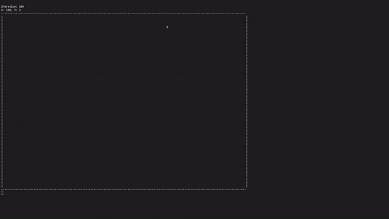

# BouncyBall
Simple Terminal Application for making a Ball bounce across your screen



## What is this project about?
BouncyBall is, as the name may suggest, an application for making a ball bounce across your screen.

It is implemented in C# because I felt like writing a C# application.

## Cloning and Compilation
### Prerequisites
You will need to have [Git](https://git-scm.com/install/) and [.NET SDK 10](https://dotnet.microsoft.com/en-us/download/dotnet/10.0) installed.

### Cloning
```bash
git clone https://github.com/Moritisimor/BouncyBall
cd BouncyBall
```
Now you're in the freshly-cloned repository.

### Compiling
```bash
dotnet publish
```

Or if you want to compile the program to a native executable:
```bash
dotnet publish -p:PublishAot=true
```

You can also just run it right now like this:
```bash
dotnet run
```

## Usage
You can simply launch the program as-is like this:
```bash
BouncyBall
```

By default, the height is 45, the Width is 100 and the Update Rate is 10ms.

To set these values yourself, you can use these flags:
- --height / -h
- --width / -w
- --update-rate / -u

A small example:
```bash
bouncyball --height=150 --width=75 --update-rate=100
```
